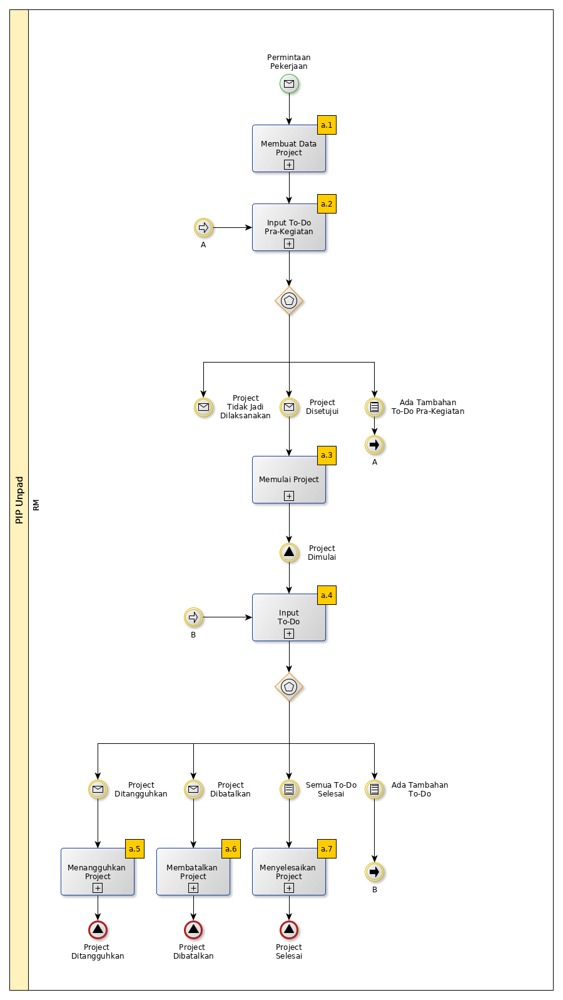

# Pengelolaan Project

### Link Instruksi Kerja

* [a.1: Membuat Data Project](/instruksi-kerja/project/input-data-awal-project.md)
* [a.2: Input To-Do Pra-Kegiatan](/instruksi-kerja/project/input-todo-pra-kegiatan.md)
* [a.3: Memulai Project](/instruksi-kerja/project/memulai-project.md)
* [a.4: Input To-Do](/instruksi-kerja/project/input-todo.md)
* [a.5: Menangguhkan Project](/instruksi-kerja/project/menangguhkan-project.md)
* [a.6: Membatalkan Project](/instruksi-kerja/project/membatalkan-project.md)
* [a.7: Menyelesaikan Project](/instruksi-kerja/project/menyelesaikan-project.md)
